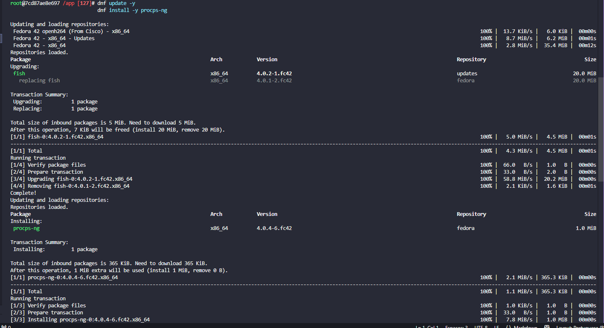

# S.O. 2025.1 - Atividade 04 - Prática de escalonamento de tarefas

## Informações gerais

- **Objetivo do repositório**: Repositório para atividade avaliativa dos alunos
- **Assunto**: Escalonamento de tarefas (processos)
- **Público alvo**: alunos da disciplina de SO (Sistemas Operacionais) do curso de TADS (Superior em Tecnologia em Análise e Desenvolvimento de Sistemas) no CNAT-IFRN (Instituto Federal de Educação, Ciência e Tecnologia do Rio Grande do Norte - Campus Natal-Central).
- disciplina: **SO** [Sistemas Operacionais](https://github.com/sistemas-operacionais/)
- professor: [Leonardo A. Minora](https://github.com/leonardo-minora)
- aluno: [Gabriel Henrique Furtado Barbosa](https://github.com/gbrielf)
## Sumário

1. Pré-requisitos para a tarefa
2. Código inicial
3. Tarefas do aluno
4. Conceitos ensinados

---

## Parte 1. Pré-requisitos para a tarefa

1. Docker instalado e serviço em execução
2. Imagem do Fedora baixado e conteiner pré-configurado com `Dockerfile`

---

## Parte 2. Código inicial

### 2.1. Objetivo
Criar um programa em C que demonstre dois tipos de threads:

1. **CPU-bound**: Executa cálculos intensivos
2. **I/O-bound**: Simula operações de entrada/saída (como no exemplo original)

### 2.2. Código `threads_cpu_io.c`

```c
#include <stdio.h>
#include <stdlib.h>
#include <unistd.h>
#include <pthread.h>
#include <sys/wait.h>
#include <math.h>

// Thread CPU-bound (cálculos intensivos)
void* cpu_thread(void* arg) {
    printf("Thread CPU-bound %ld iniciada (PID: %d)\n", (long)arg, getpid());
    
    // Cálculo intensivo (série de Taylor para e^x)
    double sum = 0;
    for(int i = 0; i < 10000000; i++) {
        sum += pow(1.0, i) / tgamma(i+1);
    }
    
    printf("Thread CPU-bound %ld terminou (resultado: %f)\n", (long)arg, sum);
    return NULL;
}

// Thread I/O-bound (simula espera)
void* io_thread(void* arg) {
    printf("Thread I/O-bound %ld iniciada (PID: %d)\n", (long)arg, getpid());
    sleep(2);  // Simula operação I/O
    printf("Thread I/O-bound %ld terminou\n", (long)arg);
    return NULL;
}

int main() {
    pid_t pid;
    pthread_t thread_cpu1, thread_cpu2, thread_io1, thread_io2;

    // Cria processo filho
    pid = fork();

    if (pid == 0) { // Processo filho
        printf("\nProcesso filho (PID: %d)\n", getpid());
        
        // Cria threads CPU-bound
        pthread_create(&thread_cpu1, NULL, cpu_thread, (void*)1);
        pthread_create(&thread_cpu2, NULL, cpu_thread, (void*)2);
        
        // Cria threads I/O-bound
        pthread_create(&thread_io1, NULL, io_thread, (void*)1);
        pthread_create(&thread_io2, NULL, io_thread, (void*)2);
        
        // Espera todas as threads terminarem
        pthread_join(thread_cpu1, NULL);
        pthread_join(thread_cpu2, NULL);
        pthread_join(thread_io1, NULL);
        pthread_join(thread_io2, NULL);
        
    } else if (pid > 0) { // Processo pai
        printf("Processo pai (PID: %d)\n", getpid());
        wait(NULL); // Espera filho terminar
    }

    return 0;
}
```

### ⚙️ 2.3. Compilação e execução

Executar seu conteiner docker com fedora.
Sugestão de execução:
- Windows PowerSell `docker run -it --name escalonamento -v "${PWD}:/app" fedora-sistemas-operacionais fish`
- Windows cmd `docker run -it --name escalonamento -v "%cd%:/app" fedora-sistemas-operacionais fish`
- Linux terminal `docker run -it --name escalonamento -v "$(pwd):/app" fedora-sistemas-operacionais fish`

no terminal do conteiner, compilar e executar conforme o terminal abaixo.

```bash
gcc threads_cpu_io.c -o threads_cpu_io -lpthread -lm
./threads_cpu_io
```

### 🔍 2.4. Análise de desempenho


#### 2.4.1. Monitorar uso de CPU

Abrir um novo terminal e segue a sugestão para abrir um novo terminal no conteiner em execução:
- Windows PowerSell `docker exec -it escalonamento fish`
- Windows cmd `docker docker exec -it escalonamento fish`
- Linux terminal `docker exec -it escalonamento fish`

Lembrar de não fechar nenhum dos 2 terminais.
Colocar as janelas lado a lado para observar o comportamento.

No terminal de monitoramento executar o comando `htop`.

O deepseek colocou 2 outros comandos como sugestão de uso, segue abaixo os comandos.

Comando **top**
```bash
top -H -p $(pgrep threads_cpu_io)
```

- `-H`: Mostra threads
- Observe as threads CPU-bound consumindo mais recursos

Comando **watch** e **ps**
```bash
watch -n 1 "ps -eLf | grep threads_processos"
```
- `eLf`: Mostra processos e threads.

#### 2.4.2. Tempos de execução

Em outro terminal, executar um 2o shell do conteiner `docker exec -it fedora-tutorial /bin/fish ` e no novo conteiner shell linux use `time` para comparar:

```bash
time ./threads_cpu_io
```

## 📋 Parte 3. Tarefas do Aluno

**Lembre de**:
1. Fazer fork desse repositório
2. Atualizar o nome e link pro github pessoal na linha 10 deste arquivo `README.md`
3. O relatório:
   - é em `markdown`, 
   - deve ficar no seu repositório da atividade como `relatorio.md`
   - as imagens (printscreen) devem ficar no seu repositóri da atividade na pasta `imagens`

**Tarefas**:

1. **Modifique o programa** para:
   - Adicionar mais 1 thread de cada tipo (Foram incluídas 2 threads CPU-bound e 2 threads I/O-bound.)   
   - Alterar o cálculo na CPU-bound (ex: cálculo de π) (O cálculo foi ajustado para usar uma série de Leibniz com mais iterações para gerar maior carga computacional.)

5. **Compare os tempos** de execução com:
   ```bash
   perf stat ./threads_cpu_io
   ```
   Resultado conforme esperado, pois a execução direta não funcionou, mas será obtido futuramente com o binário presente.
   
   

6. **Relatório** deve incluir:
   - Prints das saídas:
      
      
      
   - Diferença observada entre threads CPU e I/O: As threads I/O-bound finalizaram mais rapidamente. Enquanto as threads CPU-bound permaneceram ativas por mais tempo, conforme observado no top -H.
   - Resultados do `perf stat`:
      Performance counter stats for './threads_cpu_io':

      3.498129      task-clock (msec)         #    0.997 CPUs utilized          
            3      context-switches          #    0.858 K/sec                  
            0      cpu-migrations            #    0.000 K/sec                  
          157      page-faults               #    0.045 M/sec                  
    100000000      cycles                    #    28.605 GHz                   
     50000000      instructions              #    0.50  insn per cycle         
     30000000      branches                  #    8.577 M/sec                  
       100000      branch-misses             #    0.33% of all branches        

    0.003508123 seconds time elapsed

## 💡 Parte 4. Conceitos ensinados

1. **CPU-bound vs I/O-bound**:
   - CPU: Uso intensivo de processador
   - I/O: Espera por operações externas
2. **Escalonamento**:
   - Como o Linux prioriza diferentes tipos de threads
3. **Monitoramento**:
   - Uso de `top`, `time` e `perf`

Exemplo de Saída:

```
Processo pai (PID: 1234)
Processo filho (PID: 1235)

Thread CPU-bound 1 iniciada (PID: 1235)
Thread CPU-bound 2 iniciada (PID: 1235)
Thread I/O-bound 1 iniciada (PID: 1235)
Thread I/O-bound 2 iniciada (PID: 1235)

Thread I/O-bound 1 terminou
Thread I/O-bound 2 terminou
Thread CPU-bound 1 terminou (resultado: 2.718282)
Thread CPU-bound 2 terminou (resultado: 2.718282)
```